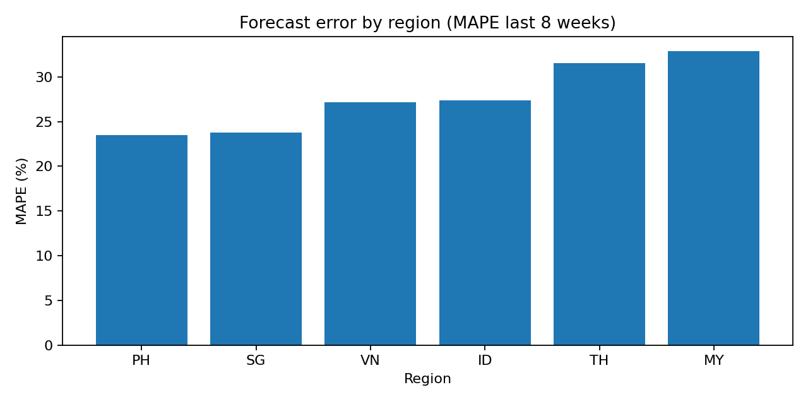
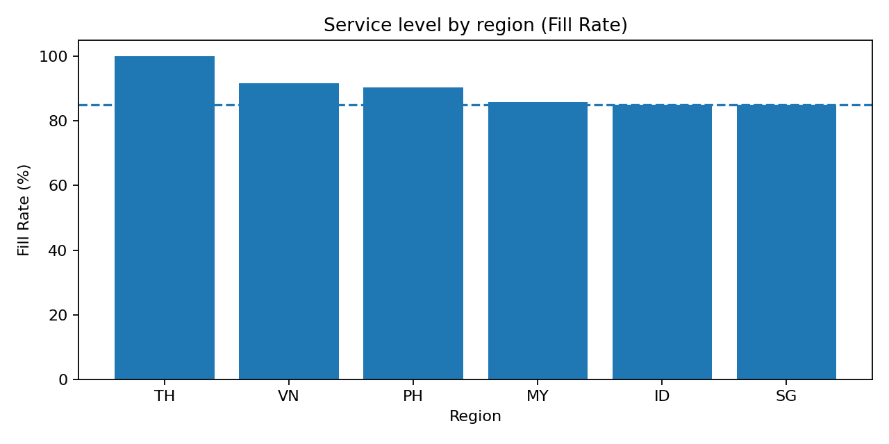
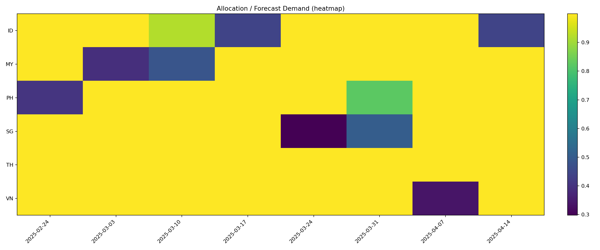

# iPhone Allocation Simulator
Demand forecasting (ARIMA) + allocation optimization (LP via PuLP) for regional iPhone launch.

## 🔥 TL;DR (Screenshots)
<p float="left">
  
  
  
</p>

## Quickstart
```bash
python3 -m venv .venv && source .venv/bin/activate
pip install -r requirements.txt
./run.sh
```

